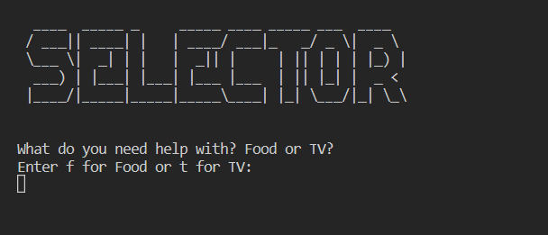
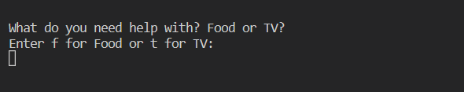
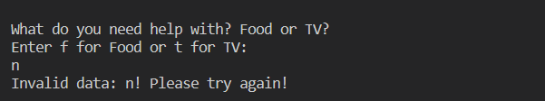

# Selector

Selector is a Python terminal program which runs in the Code institute mock on Heroku.
Users, who don't want to think about what to eat or which movie/series to watch, can use the program to get a random, or a pre choice based selection.

- This is a live version of my project. 

## How to use the program

When the program is started, the user is asked for which topic he/she would like a choice to be made. The user then has the choice between food and TV. He/She then clicks either f (for food) or t (for tv). After that, the user can decide whether the selection should be random or not. If the user clicks yes (y), he gets a random selection. If the user clicks no (n), he/she must meet one or more selection criteria before he/she receives the final decision.

- Welcome Image 

## User Stories

- As a visiting user, I can easily understand the main purpose of the program. 
- As a visiting user, I can use the program without any problems.

## Features 

- Existing Features

    - The user can choose between two main themes.
        - Food
            - The user can choose between food or drinks, or get a completely random selection.
                - Beverages can be alcoholic or non-alcoholic or randomly selected.
                - Food can be vegetarian or contain meat or randomly selected. In this case, fish is not counted as meat. The drink selection can take several minutes, which is due to the database. With over 50 thousand recipes, relatively few drinks are included.
                    - Food recipes can also be selected so that the cooking and/or baking time is shorter or longer than 30 minutes.
        - TV
            - The user can choose between movie or series, or get a completely random selection.
                - Movies and Series can be chosen randomly or pre selected by genre.
                  - Since there is no children column, it was assumed that animated films/series are suitable for children. This is of course not always the case.
    
- TV or Food? 

    - The program chooses completely randomly with or without selection criteria being met.
        - Once the user has clicked that he/she wants a decision, it can no longer be influenced.
    - If the user is dissatisfied with the selection, they can request a new selection.
    - Accepts user input
    - Input valitation and error checking
        - The user can use uppercase or lowercase letters.
        - The user cannot press non-suggested buttons.

- Input Validation 

### Future Features

  - Planned features: 
    - More topics to select. Like Sport, Musik, Cryptocurrency, Traveling Country, ...
    - Selection criterion cold or warm for drinks.
    - A quicker drink selection.
    - Selection criterion provider (Netflix, Amazone Prime, ...) for movie/series.
    - More time selection criterion for food.
    - Selection criterion main course, appetizer or dessert for food
  
  For most of these funter implementations other datasets or urls are needed or the datasets have to be changed completely.

### Data Model

  - The data comes from two csv fils downloaded from [kaggle](https://www.kaggle.com/datasets).
  - Depending on the user's choice of topic, the files are opened and cleaned in one function.
  - Depending on the selected selection criteria, the data files are filtered in specific functions.
  - Finally, the final selection is transferred to an class object. Here the selection is optically cleaned up again and output as an output. The string method of object-oriented programming seemed to me the simplest solution for a nice representation.

### Testing

I have manually tested the program by doing the following:

 - Passed the code through the Code institute - PEP8 linter and confirmed that there are no problems.
 - Given invalid inputs like wrong letters, words, signs or numbers.
 - Tested in the Code institute Heroku terminal and in my local terminal. 

 - user story besed test cases (screenshots):

  - As a visiting user, I can easily understand the main purpose of the program. 

  - As a visiting user, I can use the program without any problems.

  - Welcome Image 
  

### Bugs

 - Solved Bugs
  - When choosing a drink a food recipe appeared. 
   - This was solved with a list of words that must not appear in a drink ('Chicken', ...).
  - The final output still contained quotation marks.
   - This was solved using the Sting method in the Clean Sting class.
  - A lot of lines are too long but this did not influence the functionality. It was fixed anyway, but this made the code much more ugly and unreadable. However, since it was the requirement that no errors were allowed to occur in the CI-PEP8-Validator, all cases were cleaned up by splitting the lines.

 - Unsolved Bugs
  - Beverage selection may take minutes. This is because the data set contains about 50,000 items but only a few beverages. Although this isn't actually a bug, it's annoying. 
  - Some lines are too long but this does not influence the functionality.

## Deployment

The project was deployed using Code institut's mock for Heroku
  - Steps for deployment:
    - This repository was cloned.
    - A Herroku app was created.
    - The builsbacks were set to Python and NodeJs.
    - The Heroku app was linked to the repository
    - **Deploy** was clicked.

The live link can be found [here](https://everyday-selector.herokuapp.com/)

## Credits 

 - Code Institute for the deplyment terminal.
 - Code Institute for CI Python Linter PEP8 Valitator.

### Content

- Instructions on how to deploy on Heroku was taken from [Code Institute - Love Sandwiches Project](https://learn.codeinstitute.net/courses/course-v1:CodeInstitute+LS101+2021_T1/courseware/293ee9d8ff3542d3b877137ed81b9a5b/e3b664e16366444c8d722c5d8340b340/)
- Instructions on how to use Regular Expression in general was taken from [freecodecamp](https://www.freecodecamp.org/learn/scientific-computing-with-python/python-for-everybody/regular-expressions)
- Instructions on how to replace things with regular expression was taken from [stackoverflow](https://stackoverflow.com/questions/50230821/regex-in-python-replace-multiple-occurrences-of-comma-between-double-quotes)
- The basic code of the class object which returns a clean dictionary as a string without quotes and braces was taken from [youtube](https://www.youtube.com/watch?v=6ihzFB5qjBo)
- Instructions on how to find parts of a string in a strin was taken from [stackoverflow]https://stackoverflow.com/questions/4664850/how-to-find-all-occurrences-of-a-substring)
- Instructions on how to work with Python lists, stringsm dictionaries, loops, ... were taken from [Code Institute - Python lectures](https://learn.codeinstitute.net/ci_program/diplomainfullstacksoftwarecommoncurriculum)
- Instructions on how to work with Python lists, stringsm dictionaries, loops, ... were taken from [youtube](https://www.youtube.com/watch?v=LXV53NKfKQI)

### Media

- The Data CSVs were taken from [kaggle](https://www.kaggle.com/datasets)

### Personal Advice

  - Thank You!
    - Jubril Akolade
    - All people from my Slack Group!